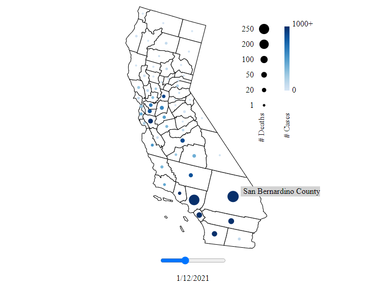

# MOVE D3 Workshop 5/20/2021

The goal of this workshop is to introduce D3.js as a way to make interactive visualizations in the browser. At the end of the workshop we will have produced a bubble map of California as shown below and as you can see [here](https://alrudolph.github.io/d3workshop/).



**You will need to download all of the files under the src folder:**

- index.html
- styles.css
- index.js
- utility.js

To run these files, you will need a browser such as Chrome, FireFox, Safari, etc.... It is also recommended that you use an IDE such as VSCode, however any text editor will work. You can open `index.html` in your browser and when you make a change to `index.js` you need to save the file and refresh your browser.

---

The rest of this README goes through the instructions for the workshop and then a description of each of the files that were glanced over in the workshop.

## Instructions

Your `index.js` file should look like:

```javascript
(async () => {
  console.log("Plotting map...");

  const CA_MAP_URL =
    "https://raw.githubusercontent.com/deldersveld/topojson/master/countries/us-states/CA-06-california-counties.json";

  const DATA_URL =
    "https://data.chhs.ca.gov/api/3/action/datastore_search?resource_id=046cdd2b-31e5-4d34-9ed3-b48cdbc4be7a&q=2021-01&limit=10000";
})();
```

Here we have an asynchronous function that is called when the file runs. Inside this function are two links: one for the map file we're going to be using and the other for the data we're going to be using.

### Plotting the map

First we need to fetch the data using:

```javascript
const mapData = await d3.json(CA_MAP_URL);
```

This line pausing the code as we wait to download the file at the given url. This file is in TopoJSON format and we need to convert it to a GeoJSON:

```javascript
const mapFeatures = topojson.feature(
  mapData,
  mapData.objects.cb_2015_california_county_20m
);
```

Logging this variable will show a familiar object similar to a GeoDataFrame / loading in a shapefile. Now to setup a way to tell D3 how to draw this data on our screen:

```javascript
const projection = d3.geoAlbersUsa().scale(2500).translate([1020, 290]);
const path = d3.geoPath().projection(projection);
```

Now we're all setup to draw the map of California. First we have to give D3 a container to work in:

```javascript
const svg = d3.select("#bubblemap").attr("width", 500).attr("height", 500);
```

Now draw the map:

```javascript
svg
  .selectAll("path")
  .data(mapFeatures.features)
  .enter()
  .append("path")
  .attr("d", path);
```

We want to change the fill color and then give the counties an outline:

```javascript
svg
  .append("g") // This group applies the styles to everything inside
  .attr("stroke", "black") // black outline
  .attr("fill", "white") // white interior
  .selectAll("path")
  .data(mapFeatures.features)
  .enter()
  .append("path")
  .attr("d", path);
```

### Adding the bubbles

I've provided a utility function to load the data we want to plot and then another one to merge that data set with our map.

```javascript
const data = await getData(DATA_URL);
const combined = combineData(data, mapFeatures);
```

We can start plotting this with D3 in a similar way:

```javascript
svg.append("g").selectAll(".bubble").data(combined).enter().append("circle");
```

Just for now, let's make the circles red with a fixed radius:

```javascript
.attr("fill", "red")
.attr("r", 5)
```

We now have to move these circles over the county centers:

```javascript
.attr("transform", (county) => {
    const translation = path.centroid(county.geometry);
    return "translate(" + translation[0] + "," + translation[1] + ")";
});
```

We want to do a translate transformation of the circles by this given function. For each county in the list of counties in `combined` this function is called, passing in the specific information for that county as `county`. We then compute the centroid from this shape's geometry. This returns a 2element array for the x and y locations of the county center. We then return a statement saying where to move the circle over.

Now we want to give circles different radiuses and colors. Starting for the colors, we can we can setup a colorscale that we will used to indicate number of cases:

```javascript
const colorScale = d3.scaleSequential(d3.interpolateYlOrRd).domain([0, 1000]);
```

This creates a function that maps values [0, 1000] to this Yellow To Orange To Red scheme. We could set this up so the upper limit is the maximum value of the data, but for simplicity I'm setting the max to 1000 and anything over will be capped at this color.

To use the color scale, we'll replace our `fill` with the following:

```javascript
.attr("fill", (county) => {
    return colorScale(county.data[0].cases);
})
```

For each county, we get the first day data (index 0) and get the number of cases. Later, we will allow changing of the week.

For the radius, we will construct a similar function:

```javascript
const radiusScale = d3.scaleSqrt().domain([0, 250]).range([2, 10]);
```

This maps values from 0 to 250 to values 2 to 10 using a sqrt function.

We can now replace the radius attribute as follows:

```javascript
.attr("r", (county) => {
    return radiusScale(county.data[0].deaths);
})
```

This gets the death count for the first day.

### Hooking up the input

The following code sets up or slider input:

```javascript
d3.select("#slider")
  .attr("type", "range")
  .attr("min", 0)
  .attr("max", combined[0].data.length - 1)
  .attr("value", 0);
```

First, we select our `slider` using the id we give it in the html. We specify this is a range type slider, instead of text or checkbox inputs. We can set the minimum value to 0 and the maximum value to the number of days we have (we have 31 days so the max index is 30) and the starting value to 0.

When you move the slider an `input` event is called and we can attach an event listener as follows:

```javascript
.on("input", (event) => {
    console.log(event.target.value)
})
```

Now, you can watch the current value be printed out as you move the slider.

I want to make a function that handles all of the updates we need to make and this event handler simply just call that function:

```javascript
const updateWeek = (week) => {};

d3.select("#slider")
  .attr("type", "range")
  .attr("min", 0)
  .attr("max", combined[0].data.length - 1)
  .attr("value", 0)
  .on("input", (event) => {
    updateWeek(event.target.value);
  });
```

The first thing we want to do is hook it up to our bubbles. First, we can save the bubles to an object:

```javascript
const bubbles = svg
    .append("g")
    .selectAll(".bubble")
    ...
```

Then we can remove the `fill` and `r` attributes we originally had and instead place them here:

```javascript
const updateWeek = (week) => {
  bubbles
    .transition()
    .attr("fill", (county) => {
      return colorScale(county.data[week].cases);
    })
    .attr("r", (county) => {
      return radiusScale(county.data[week].deaths);
    })
    .duration(100);
};
```

This setups a transition with a 100ms delay to see the change in action!

We can also setup our counter below the slider:

```javascript
const updateWeek = (week) => {
    const date = combined[0].data[week].date

    d3.select("#date").text(
        date.getUTCMonth() +
        1 +
        "/" +
        date.getUTCDate() +
        "/" +
        date.getUTCFullYear()
    )
    ...
}
```

The month value starts from 0, so we need to add 1 and then we can get the day number from `.getUTCDate()` and the 4 digit year from `.getUTCFullYear()`.

We need to call this on the first week to get the bubbles to show up on load. At the end of our function put:

```javascript
updateWeek(0);
```

Now you can see the values change as you move the slider!

### Making the plot interactive

When you put your mouse over one of the circles, a `mouseover` event is fired and we can add a listener to our bubbles as follows:

```javascript
const highlightCounty = (target) => {}

const bubbles = svg
    .selectAll(".bubble")
    ...
    .on("mouseover", (event) => {
        highlightCounty(event.target)
    })
```

Then when you hover over a bubble, we get the event and pass the county node into a function called `highlightCount`.

We also need a way of knowing the current week index in this function. At the top of the main function create a new variable:

```javascript
let currWeek = 0;
```

And at the bottom of our `updateWeek` function lets update this value:

```javascript
currWeek = week;
```

The first thing I want to do is increase the size of the bubble when you hover over. Inside of `highlightCounty`:

```javascript
const bubble = d3.select(target);
const county = bubble.datum();
const currentRadius = radiusScale(county.data[currWeek].deaths);
```

Now we have accuss to the bubble and the data that was binded to the data and the current radius size.

So let's double the current radius size and then when your mouse leaves, set the current radius back.

```javascript
bubble.attr("r", currentRadius * 2).on("mouseout", () => {
  bubble.attr("r", currentRadius);
});
```

Now let's add a tooltip. First we'll get the position of the circle:

```javascript
const translation = path.centroid(county.geometry);
```

And then let's offset where we put our text:

```javascript
const x = translation[0] + 15;
const y = translation[1] - 20;
```

Let's create a group for our text and background:

```javascript
const tooltip = svg
  .append("g")
  .attr("transform", "translate(" + x + "," + y + ")");
```

The background will be a rectangle with a fitting gray color:

```javascript
tooltip
  .append("rect")
  .attr("width", 160)
  .attr("height", 20)
  .attr("fill", "#D3D3D3");
```

Then we can append text on top:

```javascript
tooltip
  .append("text")
  .text(county.properties.NAME + " County")
  .attr("y", 15)
  .attr("x", 5);
```

When our mouse leaves, we also want to remove our entire tooltip:

```javascript
bubble.attr("r", currentRadius * 2).on("mouseout", () => {
  bubble.attr("r", currentRadius);
  tooltip.remove(); // Add this line to remove text and rectangle
});
```

### Finishing up

Now we want to add our legend. For time considerations, I included a function to do this for us.

```javascript
makeLegend(svg, colorScale, radiusScale);
```

It takes our svg and uses the same color and radius scales. Making it is sort of tedious to get all of the positioning correct but it uses all of the same concepts that we've learned in this workshop.

### Deployment

Under the final folder you can find the completed index.js file. Once you have your completed files, you can deploy them with GitHub Pages. Make a new repo with these four files at the top level and then go to Settings -> Pages and enable github pages. Then you can see a link to github-pages under 'Environments' in your repo.

---

The rest of this README goes over the additional files that were provided.

## example.js

Most of the syntax in Javascript should look familiar if you're coming from another programming language. This section goes over a few basic parts of the language that we will be using throughout the workshop.

To declare a variable in Javascript, we can use the `let` keyword.

```javascript
let a = 2;
```

In many cases, we won't need to change the value of a variable after initializing it, in which case we should make it a constant using the `const` keyword.

```javascript
const b = 5;
```

If we want to print out the value of a variable or constant we can use `console.log()`. If we want to print out multiple values, we can separate the names using a comma.

```javascript
console.log(a, b);
```

In the browser, you can view this output by right clicking the screen, then selecting inspect and then going to "console" (on Chrome and Firefox).

In this workshop we will be using arrow function expressions. To make a function this way, you need a pair of parenthesis (and any parameters inside) followed by an arrow into curly brackets. The following function takes two parameters, `m` and `n` and returns the product of these two values.

```javascript
(m, n) => {
  return m * n;
};
```

In `example.js` you may notice a semicolon in front of this function. In Javascript, semicolons at the end of a line are optional, however, in certain instances you make get weird results if you don't include them. The reason that a semicolon is needed here (or anywhere after the `console.log()`) is because Javascript will read the file as:

```javascript
console.log(a, b)(m, n) => {
  return m * n
}
```

which is not what we want. In general, this shouldn't be a problem as it doesn't make sense to have an anonymous function on its on line like this.

If we want to call a function later, we can assign it to a variable (and typically you want to make it a constant). Here, we assign the function shown above to a constant called mult.

```javascript
const mult = (m, n) => {
  return m * n;
};

console.log(mult(8, 9));
```

Passing in the two numbers, 8 and 9 will log 72.

## index.html

HTML files specify the structure of our website.

We have to start the file by declaring it's type as an html document. Then all of our html will be within the `html` tags. I also specified the language as English.

```html
<!DOCTYPE html>
<html lang="en">
  ...
</html>
```

The rest of code is split into two sections: the head and the body.

#### head

The head element is inclosed in the following tags: `<head></head>`. In the head we can specify metadata about or document.

The following metadata is optional, but can improve compatibility across devices.

```html
<meta charset="UTF-8" />
<meta http-equiv="X-UA-Compatible" content="IE=edge" />
<meta name="viewport" content="width=device-width, initial-scale=1.0" />
```

Here we link to our `styles.css` style sheet that is discussed below.

```html
<link rel="stylesheet" href="styles.css" />
```

The following `script` tags import D3, Topojson and a file with utility functions that I've included.

```html
<script src="https://d3js.org/d3.v6.min.js"></script>
<script src="https://unpkg.com/topojson@3"></script>
<script src="utility.js"></script>
```

The final line sets the title of our document. You can see this title in the tab for the page in your browser.

```html
<title>MOVE D3 Workshop</title>
```

#### body

The body, as enclosed by the following tags: `<body></body>` includes the contents that will be shown in the browser.

In order to center the content on the page, I've wrapped everything inside of `<main>` tags. You can use these tags once on a page, to specify the main content on the page. You could use, for example, a `div` here, but we want the tags we use to reflect the type of content inside of them, [see semantic html](https://www.w3schools.com/html/html5_semantic_elements.asp). The `h1` tags represent headings for the page and by default are larger than `h2`, `h3`, ... tags. The paragraph tag, `p`, indicates this is text content.

The map, slider and date are all wrapped inside of a div with the id 'map'. This id is used to individually apply a style to this div in styles.css.

```html
<div id="map">...</div>
```

The `svg` tag is a container for SVG graphics. I give this element an id, so that D3 can select this element later, to start attaching the map to it.

```html
<svg id="bubblemap"></svg>
```

There are many different types of inputs in HTML. In our index.js file we will attach attributes to this element to make it a slider.

```html
<input id="slider"></input>
```

At the end of our body, we want to include the script that will run our d3 code:

```html
<script src="index.js"></script>
```

We need this at the end of our body since D3 operates on some of the html elements defined above and these need to be placed on the page before D3 can start accessing them. Putting the script at the end of our body like this will run the script once the page has been loaded.

## styles.css

Most of the styling here centers the html content described above. I really like using [Flexbox](https://css-tricks.com/snippets/css/a-guide-to-flexbox/) to do this. However, on browsers such as Safari, Flexbox won't work so the styles are duplicated with a `-webkit-` prefix.

The rule for `body` centers the `main` component horizontally.

The width of the `main` component is 40% of the viewing area, however it is always at least 375px.

In CSS, you use pound signs to select an id. `#map` selects the div with the id `map` and I set the width of it to 100% of the main area and horizontally center the components inside of it.

The styling applied to `input` makes it so that when your mouse hovers over the slider, it changes your cursor to indicate that you can select and drag the slider.

## utility.js

The file, utility.js, includes three functions to help remove tedious parts of the workshop: `getData`, `combineData`, `makeLegend`.

#### getData()

First, this function is marked as `async` so that we can use the `await` keyword to fetch our data.

Calling `d3.json(url)` returns an object of the form:

```javascript
{
    help: "...",
    result: {
        records: [
            {
                area: "Santa Barbara",
                area_type="County",
                cases: "52.0",
                date: "2021-03-01",
                ...
            },
            ...
        ],
        ...
    },
    succes: true
}
```

We can see that the data we want is an array under `result.records`, which we can extract as just a variable called `records` using object destructuring:

```javascript
const {
  result: { records },
} = await d3.json(url);
```

From there, we just have to filter and group the data.

Filter iterates over each item in the array and I use desctructing again to get the `date` and `area` properties from each record. Then I check that the month is January and the area is an actual county name.

```javascript
records.filter(
  ({ date, area }) =>
    date.substr(5, 2) === "01" &&
    !["Unknown", "Out of state", "California"].includes(area)
);
```

Now we have an array of objects for every county for every day in January 2021. Next, we want to group this array by county. I use the `forEach` method to iterate over each county again. This time, I add counties to the `output` object, if they aren't already in it. If the county is in `output` then I push the values into an array for that county.

```javascript
.forEach((county) => {
    /*
        These are the objects I want to store.
        Adding a + in front of values converts them to numbers.
        I also create date objects out of the date strings.
    */
    const d = {
        deaths: +county.deaths,
        cases: +county.cases,
        date: new Date(`${county.date} PST`),
    }

    /*
        We check if the county name (county.area) is already included
        in our output keys. Object.keys(output) returns an array of
        the county names we already have and we check if it .includes
        the current county
    */
    if (Object.keys(output).includes(county.area)) {
        // Push the data into output:
        output[county.area].push(d)

        // Sort by date:
        output[county.area].sort(
        ({ date: date1 }, { date: date2 }) =>
            (date1.getUTCDate() > date2.getUTCDate()) -
            (date1.getUTCDate() < date2.getUTCDate())
        )
    } else {
        // Create the new key for output and start the array
        output[county.area] = [d]
    }
    })
```

Finally, we return an object where each key is the county name and value is an array of `{ deaths, cases, date }` objects for that county.

#### combineData()

If we combine our map and values into a single object, then accessing these values later is easier as all of this data will be bound to our map and we won't need a bunch of array.find()'s.

We want to join our data by county. The county names in the topojson object are stored as the keys in the `.features` object. First, we get an array of all of these keys `Object.keys(map.features)` then map over them (we're returning a copy of the array where each value is modified).

```javascript
Object.keys(map.features).map((key) => {
    ...
})
```

All of the county geometry and properties data from the topojson map is stored in `county`. We also get the array of daily case/death/date data using `data[county.properties.NAME]`.

The ellipses, `...` _spreads_ the county object out to return an object with the data property added. In python this is the same as using `**` on a dictionary.

The combined data is of the form:

```javascript
[
    {
        data: [{ cases, deaths, date }, ...],
        geometry: {...},
        properties: {...}
    },
    ...
]
```

And you can see that our cases/deaths/date data is appended for each county.

#### makeLegend()

Making a legend like this is basically just making another plot and fine tuning values to make it look nice.

The first part makes the colorbar. `d3.range(1000, -1, -1)` returns an array `[1000, 999, ..., 0]`. We use this data to position and color small rectangles which make up our colorbar.

```javascript
svg
  .append("g")
  .attr("transform", "translate(430, 50)")
  .selectAll(".bars")
  .data(d3.range(1000, -1, -1))
  .enter()
  .append("rect") // append rectange
  .attr("class", "bars")
  .attr("width", 10)
  .attr("height", 1)
  .attr("x", 0)
  .attr("y", (d) => {
    return d / 8;
  })
  // I want the colors to increase the other way:
  .attr("fill", (d) => colorScale(1000 - d));
```

For the circles, I specified values to plot in an array called `sizes`. We use `d3.range` again but this time for the indices of the `sizes` array.

```javascript
legendCircles
  .append("g")
  .selectAll(".legendcircles")
  .data(d3.range(sizes.length))
  .enter()
  .append("circle")
  .attr("width", 10)
  .attr("height", 10)
  .attr("r", (d) => radiusScale(sizes[d])) // call the same scale as on the map
  .attr("cx", 0)
  .attr("cy", (d) => circlePos(d));
```

Very similar code follows to append text that labels each of these circles. The rest of this function just places labels for the two legends and limits on the color bar.
